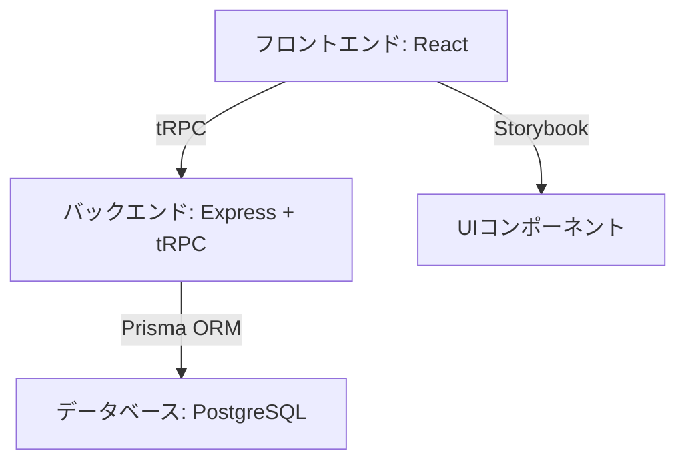
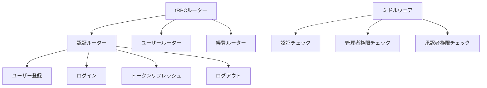
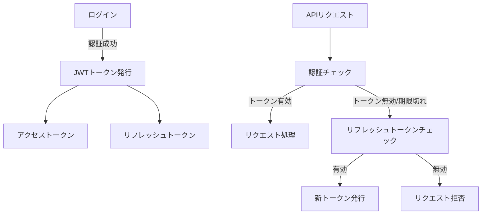
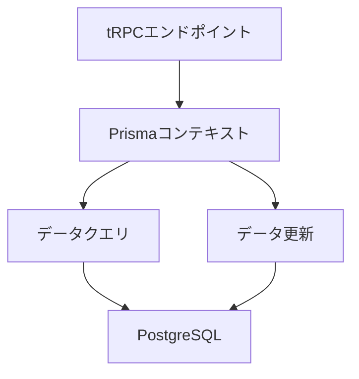
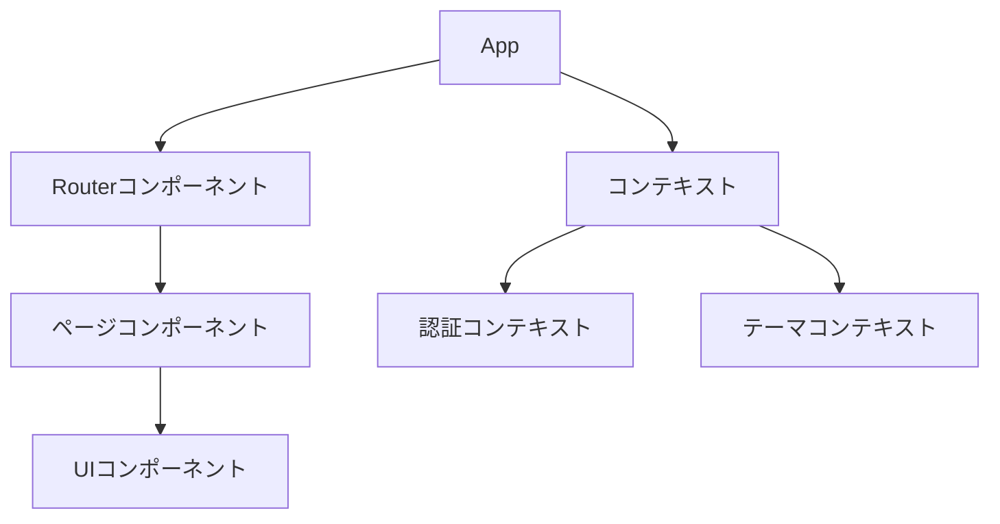
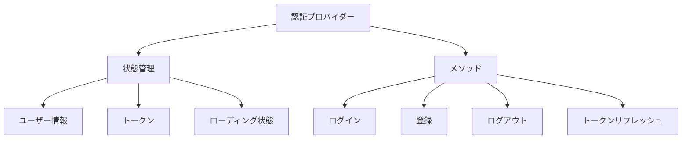

# システムパターン

## アーキテクチャ概要

Pocket Expenseは、モダンなウェブアプリケーションアーキテクチャを採用しています：

## バックエンドアーキテクチャ

### tRPC API設計

tRPCを使用して型安全なAPIを実装しています。主要なコンポーネントは以下の通りです：

### 認証・認可システム

JWTベースの認証システムを実装しています：

### データアクセスパターン

Prisma ORMを使用してデータベースアクセスを抽象化しています：

## フロントエンドアーキテクチャ

### コンポーネント構造

Reactコンポーネントは以下の階層で構成されています：

### 認証状態管理

Reactコンテキストを使用して認証状態を管理しています：

## 設計パターン

### リポジトリパターン

Prisma ORMを使用してデータアクセスを抽象化しています。

### ミドルウェアパターン

tRPCミドルウェアを使用して認証・認可を実装しています。

### コンテキストパターン

Reactコンテキストを使用して状態管理を実装しています。

### 型駆動開発

TypeScriptとtRPCを使用して型安全なアプリケーション開発を実現しています。
